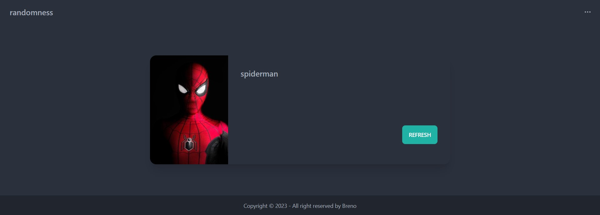
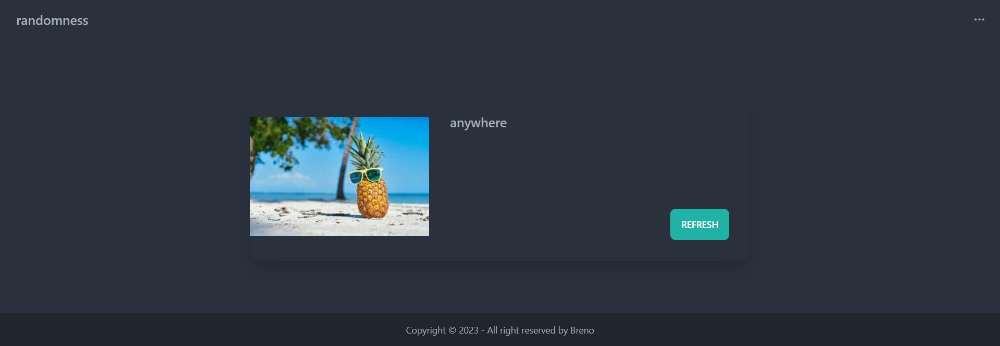
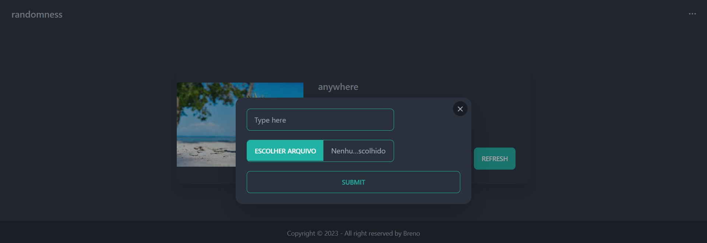

# RANDOM FRONTEND

## 👀 Como ficou ???

</img>
----------
</img>
----------
</img>
----------

## ⌨️ Sobre o projeto

O projeto consiste num frontend que consome uma api java, na qual trás uma imagem e frase aleatória. Ele foi criado utilizando [Next](https://nextjs.org/).

## 🧑‍💻 Tecnologias usadas

O projeto foi desenvolvido com as seguintes tecnologias:
- [React JS](https://pt-br.reactjs.org/)
- [Axios](https://axios-http.com/ptbr/docs/intro)
- [Tailwind](https://tailwindcss.com/docs/guides/nextjs)
- [DaisyUI](https://daisyui.com/components/navbar/)

## Rodar o projeto

Primeiramente é necessário ter o node, caso não tenha faça a instalação do[NODE](https://nodejs.org/en/download/).

## `npm install`

É necessário dar um "npm install" ou "npm i", para instalar as depêndencias do projeto.

## `npm run dev`

Depois de ter instalado as dependências, basta dar um "npm start", para rodar o projeto em modo desenvolvedor. Abra [http://localhost:3000](http://localhost:3000) para vê o projeto em seu navegador.
